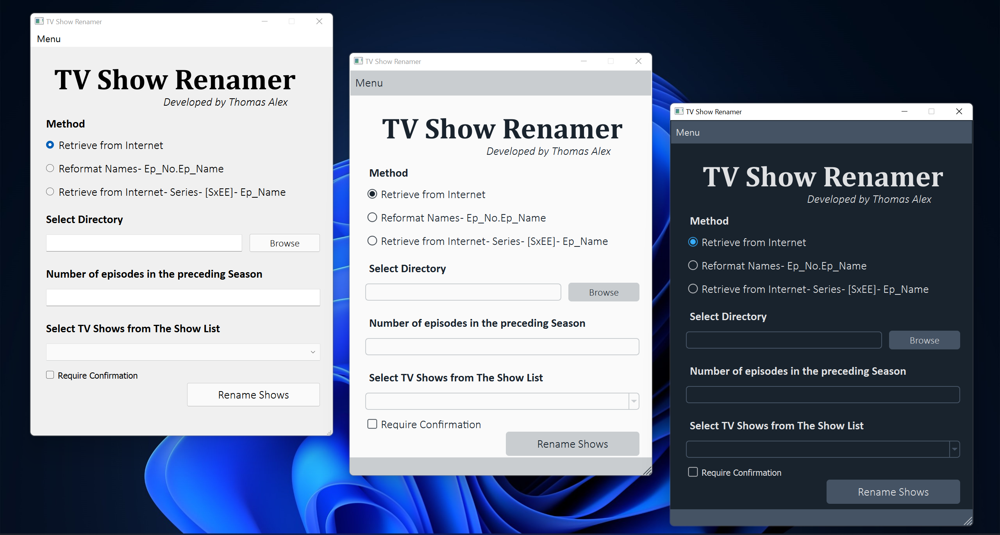

# TV Show Renamer

This an app developed to batch rename all your favorite shows to the human-readable format with episode names fetched from the Wikipedia link provided in the database

It was initially a CLI based python project of mine that I solely developed to make my life easier. I however kept improving it over the years and made a simple GUI with PyQT. That's when I felt that app has become decent enough to share this with others who would also love to find out a way to more easily organize their media collection.

## How to use

- Ensure the TV show name and the Wikipedia page with episodes lists is in the CSV file
- Ensure your files are named in SXXEXX format. This is how the app determines the episode and season number. Otherwise, it will not work
- Open the App
- Choose the "Retrieve from the Internet" option. Ignore the rest
- Select the folder directory with the episodes to be renamed
- Enter the total number of episodes released for that show in the preceding season. If the show is in season 1, the value will be 0. If the show in season 2 and season 1 had 12 episodes, the value will be 12. If the show had 8 seasons and the total number of episodes up till the previous season was 86, the value will be 86
- Click on the "Require confirmation" checkbox, for the app to double-check with a user about renaming each file. Please run it like this a few times until you are confident that the app can rename your collection properly
- Click on rename. If any file(s) are not renamed, an alert box will show up

## Known Issues

- The app needs to know how many total episodes were there in the preceding season. This is a huge limitation and something I was not able to solve while I was building this years ago. I will look into it and fix it at some point
- The app will not be able to rename clubbed episode releases
- The second and third option for retrieval hasn't been tested properly and should be ignored. I had developed it for only my specific use case and would largely remain irrelevant to others (I will probably remove it from the UI at some point)

## Download Link
Currently, the app has only been tested and built in Windows. But the app can be compiled for Linux and macOS using PyInstaller. 

You can download the Windows 10/11 version of the app from the link [here](https://github.com/Thomasalex2/tv-show-renamer/releases)

Please feel free to add your own shows to the accompanying CSV database file. 

## Demo

https://user-images.githubusercontent.com/24490575/143748767-1444a152-4006-413f-885a-076691c380ca.mp4

