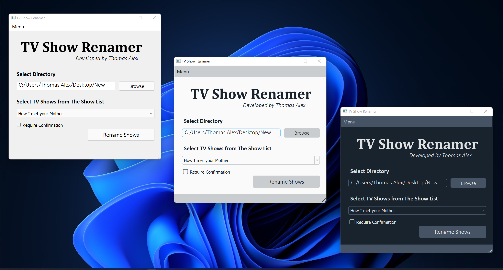

# TV Show Renamer

|  |
|:--:| 
| *TV Show Renamer v4.2* |

This is an app developed to batch rename all your favourite shows to a user-friendly format with episode names fetched from the Wikipedia link provided in the database.

It was initially a CLI based python project of mine that I solely developed to make my life easier. I however kept improving it over the years and made a simple GUI with PyQT. That's when I felt that app has become decent enough to share this with others who would also love to find out a way to more easily organize their media collection.

## How to use

- Ensure the TV show name and the Wikipedia page with episodes lists is in the CSV file
- Ensure your files are named in SXXEXX format. This is how the app determines the episode and season number. Otherwise, it will not work
- Open the App
- Select the folder directory with the episodes to be renamed
- Click on the "Require confirmation" checkbox, for the app to double-check with a user about renaming each file. Please run it like this a few times until you are confident that the app can rename your collection properly
- Click on rename. If any file(s) are not renamed, an alert box will show up

## Known Issues

- The app will not be able to rename clubbed episode releases. For now it will just skip through those episodes (I will add support for this in the future)

## Download Link
Currently, the app has only been tested and built in Windows. But the app can be compiled for Linux and macOS using PyInstaller. 

You can download the Windows 10/11 version of the app from the link [here](https://github.com/Thomasalex2/tv-show-renamer/releases)

Please feel free to add your own shows to the accompanying CSV database file. 

## Demo

https://user-images.githubusercontent.com/24490575/151146979-ed2c5baf-cc96-4ab5-87ec-45f439bb20ec.mp4

## Upcoming Features
- Give the app the ability to rename clubbed episodes as well
- Have an option to add shows directly through the app without touching the CSV file
- Auto detect show name from the file names
- Rename a folder containing shows from different TV shows
- Add a terminate option in case you want to stop the renaming process midway (will only be possible if "Require confirmation" is checked, otherwise the app will be too fast for you to stop it :sweat_smile:)

Feel free to raise a request if any other features would be useful to have
